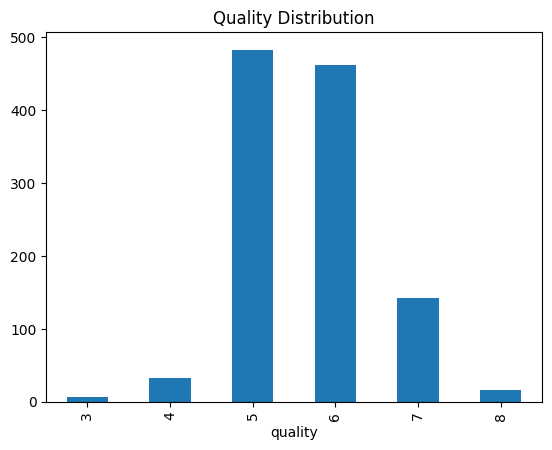
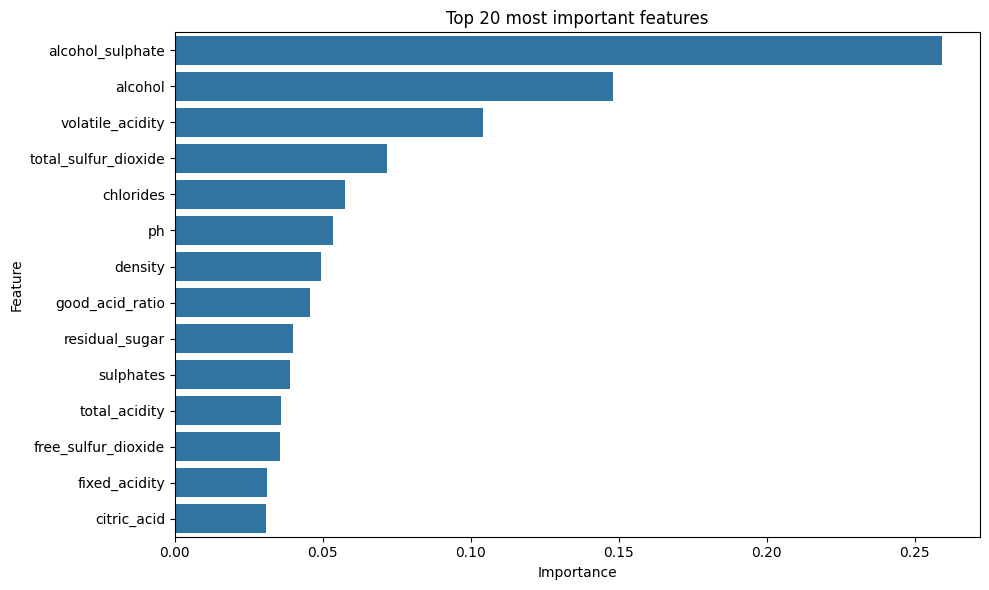
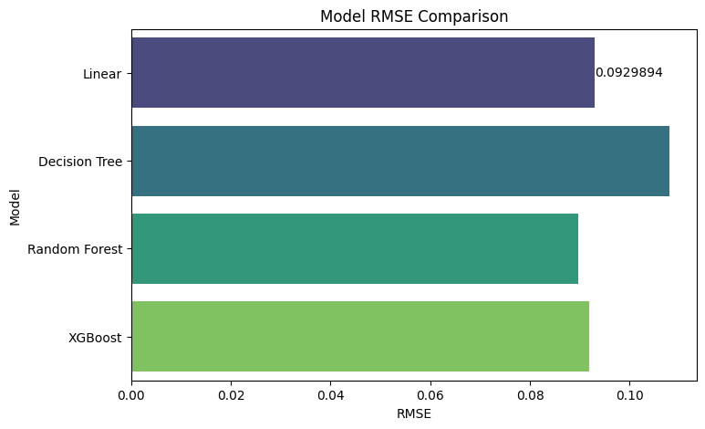
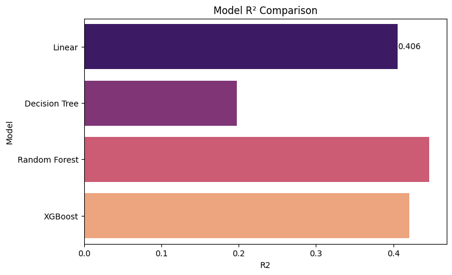
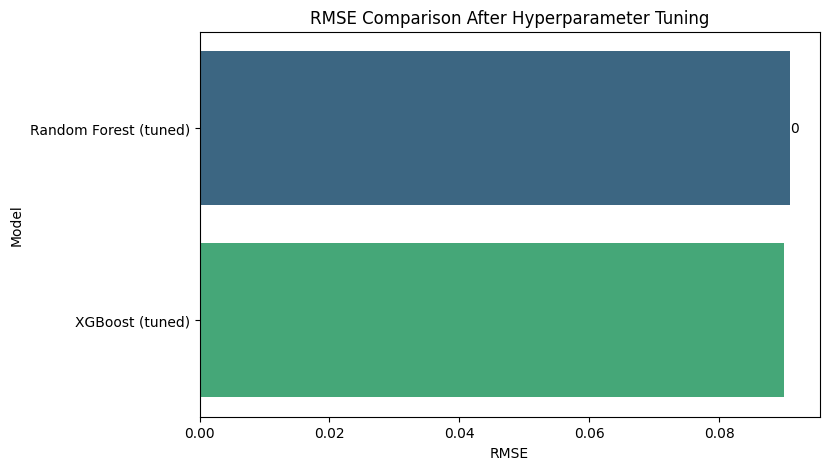
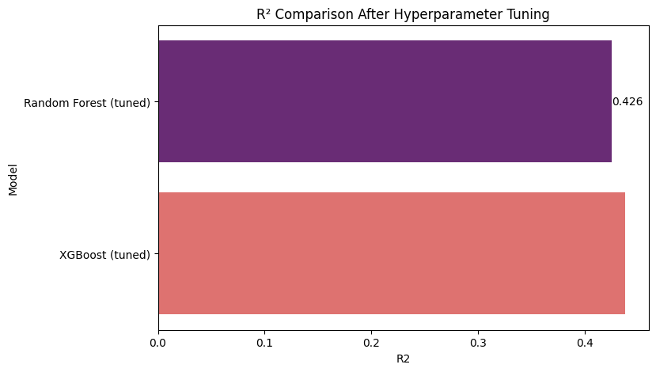

# AI Sommelier: Wine Quality Prediction 


## Problem Description

Wine quality assessment traditionally relies on human experts, whose evaluations can be subjective, time-consuming, and inconsistent. With the growth of wine production and distribution, there is a need for a reliable, scalable, and data-driven way to estimate wine quality before it reaches consumers or goes into further processing.

This project uses the [Wine Quality Dataset](https://www.kaggle.com/datasets/yasserh/wine-quality-dataset) to build a machine learning model that predicts the quality score of wine based on its physicochemical properties (such as acidity, sugar level, pH, sulfur dioxide, alcohol content, etc.). By analyzing these features, the model aims to estimate wine quality in a consistent and objective way.

The solution can be used by:

- wine producers — to monitor and improve production quality

- quality control teams — to automate quality screening

- researchers and students — to explore real-world regression/classification problems

- data scientists — to experiment with feature engineering and model performance optimization

Ultimately, this project demonstrates how machine learning can support decision-making in the food and beverage industry by transforming laboratory measurements into actionable quality predictions.


## Dataset Description

Source: https://www.kaggle.com/datasets/yasserh/wine-quality-dataset


### Columns Description

The dataset contains physicochemical properties of wine along with a quality score assigned by experts. Below is the description of each column:

| Column Name              | Type        | Description |
|--------------------------|------------|-------------|
| `fixed acidity`          | float      | Amount of non-volatile acids present in the wine (such as tartaric acid). Affects taste and stability. |
| `volatile acidity`       | float      | Amount of volatile acids (including acetic acid). High values may lead to a vinegar-like taste. |
| `citric acid`            | float      | Concentration of citric acid, which can add freshness and flavor to wine. |
| `residual sugar`         | float      | Remaining sugar after fermentation. Influences wine sweetness. |
| `chlorides`              | float      | Concentration of salts in wine, measured as chlorides. |
| `free sulfur dioxide`    | float      | Free SO₂ that helps prevent microbial growth and oxidation. |
| `total sulfur dioxide`   | float      | Total amount of SO₂ (free + bound forms). |
| `density`                | float      | Density of the wine, dependent on alcohol and sugar content. |
| `pH`                     | float      | Acidity level of the wine (0–14). Lower pH indicates higher acidity. |
| `sulphates`              | float      | Sulphates added to wine, impacting taste, preservation, and stability. |
| `alcohol`                | float      | Alcohol content of the wine (percentage by volume). |
| `quality`                | integer   | Target variable: wine quality score rated by experts (typically from 0 to 10). |


### Descriptive Statistics (`df.describe()`)

#### 1. **Key Statistics Overview**
| Metric | Count | Mean | Std | Min | 25% | 50% (Median) | 75% | Max |
|--------|-------|------|-----|-----|-----|--------------|-----|-----|
| **fixed acidity** | 1143 | 8.31 | 1.75 | 4.6 | 7.0 | 7.9 | 9.0 | 15.9 ⚠️ |
| **volatile acidity** | 1143 | 0.53 | 0.18 | 0.12 | 0.39 | 0.52 | 0.64 | 1.58 ⚠️ |
| **citric acid** | 1143 | 0.27 | 0.20 | 0.0 | 0.09 | 0.26 | 0.42 | 1.0 ⚠️ |
| **residual sugar** | 1143 | 2.53 | 1.36 | 0.9 | 1.9 | 2.2 | 2.6 | 15.5 ⚠️ |
| **chlorides** | 1143 | 0.09 | 0.05 | 0.01 | 0.07 | 0.08 | 0.09 | 0.61 ⚠️ |
| **free sulfur dioxide** | 1143 | 15.61 | 10.25 | 1.0 | 7.0 | 14.0 | 21.0 | 68.0 ⚠️ |
| **total sulfur dioxide** | 1143 | 45.91 | 32.78 | 6.0 | 21.0 | 37.0 | 61.0 | 289.0 ⚠️ |
| **density** | 1143 | 0.997 | 0.00 | 0.99 | 0.996 | 0.997 | 0.998 | 1.00 |
| **pH** | 1143 | 3.31 | 0.15 | 2.74 | 3.21 | 3.31 | 3.40 | 4.01 ⚠️ |
| **sulphates** | 1143 | 0.67 | 0.17 | 0.33 | 0.55 | 0.62 | 0.73 | 2.00 ⚠️ |
| **alcohol** | 1143 | 10.44 | 1.08 | 8.40 | 9.50 | 10.20 | 11.10 | 14.90 |
| **quality** (target) | 1143 | **5.66** | **0.81** | 3 | 5 | **6** | 6 | 8 |

#### 2. **Data Quality & Distribution Insights**
- **No missing values** (confirmed from `df.info()`): All 1143 samples complete.
- **Target distribution** (`quality`): 
  - Mean ≈ 5.66, Median = 6 → **slightly left-skewed** (most of fines 5-6).
  - Range: 3–8 (ordinal scale) → Suitable for **regression** (predict score) or **classification** (multi-class).
  - Low variance (std=0.81) → Balanced but narrow target range (good for models, less overfitting risk).
- **Feature distributions**:
  - **Normal-like**: `density` (std=0.001), `pH` (std=0.15), `alcohol` — tight ranges, minimal preprocessing needed.
  - **Right-skewed** (mean > median, fat tails): `residual sugar`, `chlorides`, `sulphates`, sulfur dioxides — common for chemical properties.
  - **Critical ranges** (domain knowledge for white wine):
    - `fixed acidity`: 7–9 g/L (healthy); max 15.9 — very high (potential spoilage).
    - `volatile acidity`: <0.6 g/L ideal; max 1.58 — too high (vinegar taste).
    - `alcohol`: 9–12% typical; good spread.

#### 3. **Outliers Detected (Potential Data Issues)**
- **High max values** (⚠️ above 75% + 3*IQR likely outliers):
  | Feature | Max | Issue |
  |---------|-----|-------|
  | total sulfur dioxide | 289 mg/L | **Extreme outlier** (normal: <100–150; preservative overdose?) |
  | free sulfur dioxide | 68 mg/L | High (normal: 15–30) |
  | residual sugar | 15.5 g/L | Sweet wine spike |
  | fixed acidity | 15.9 g/L | Acidic spoilage? |
- **Impact**: Outliers can bias tree models less (XGBoost/RF robust), but hurt Linear Regression. **Recommendation**: Investigate with boxplots; cap/remove top 1–5%.

#### 4. **Business Insights (Wine Quality Context)**
- **alcohol** (mean=10.44%, std=1.08): Strongest correlate with quality (higher % → better rating; sommelier knowledge).
- **Sulfur dioxides**: High variance → preservatives affect quality negatively if excessive.
- **Low std in density/pH**: Stable fermentation process; less predictive power.
- **Skewness suggests feature engineering**: Log-transform skewed features (e.g., `log(residual sugar +1)`).


## Exploratory Data Analysis (EDA)

### 1. Target Analysis (quality)



**Strong class imbalance**: 82.7% of wines are rated average (5–6), which is typical for the Wine Quality dataset.

**Most common ratings**: Quality 5 and 6 dominate (483 + 462 samples), making the mode = 6.

**Rare extremes**: Only 1.9% of samples are high-quality (7–8), and 3.4% are low-quality (3–4). This creates a challenge for accurately predicting outstanding or poor wines.

**Ordinal scale**: Values range from 3 to 8 (no 9 observed in this subset), confirming suitability for regression (predicting a score) while acknowledging classification-like behavior due to discrete integers.

  | Quality | Count | Percentage |
  |---------|-----|-------|
  | 5 | 483 | 42.3% |
  | 6| 462 | 40.4% |
  | 7 | 143 | 12.5% |
  | 4 | 33 | 2.9% |
  | 8 | 16 | 1.4% |
  | 3 | 6 | 0.5% |

**Strong class imbalance**: 82.7% of wines are rated **average** (5–6), which is typical for the Wine Quality dataset.

**Most common ratings**: Quality 5 and 6 dominate (483 + 462 samples), making the mode = 6.

**Rare extremes**: Only 1.9% of samples are high-quality (7–8), and 3.4% are low-quality (3–4). This creates a challenge for accurately predicting outstanding or poor wines.

**Ordinal scale**: Values range from 3 to 8 (no 9 observed in this subset), confirming suitability for regression (predicting a score) while acknowledging classification-like behavior due to discrete integers.


### 2. Missing Values

The dataset not contains missing values.

### 3. Numerical Features


### 4. Top 20 Important Features



#### 1. Strongest Correlations with Target (`quality`)

| Feature              | Correlation | Strength & Direction          | Interpretation |
|----------------------|-------------|-------------------------------|----------------|
| **alcohol**          | **+0.48**   | Strongest positive            | Highest alcohol content → significantly better quality (key driver). |
| **volatile acidity** | **-0.41**   | Strongest negative            | Higher volatile acidity (vinegar taste) → major quality reducer. |
| **sulphates**        | +0.26       | Moderate positive             | Contributes to preservation and slight quality improvement. |
| **citric acid**      | +0.24       | Moderate positive             | Adds freshness, positively impacts perceived quality. |
| **fixed acidity**    | +0.12       | Weak positive                 | Minor positive influence. |
| **chlorides**        | -0.12       | Weak negative                 | Higher salt content slightly harms quality. |
| **density**          | -0.18       | Weak negative                 | Indirect effect (often linked to sugar/alcohol). |
| **total sulfur dioxide** | -0.18   | Weak negative                 | Excess preservative can negatively affect taste. |
| Others (residual sugar, pH, free sulfur dioxide) | < |±0.07| | Almost no linear relationship with quality. |

**Top predictors of wine quality** (absolute correlation > 0.2):  
1. **alcohol** (+0.48)  
2. **volatile acidity** (-0.41)  
3. **sulphates** (+0.26)  
4. **citric acid** (+0.24)

#### 2. Notable Multicollinearity Between Features

| Feature Pair                             | Correlation | Insight |
|------------------------------------------|-------------|---------|
| fixed acidity ↔ density                  | +0.68       | Strong: Acids increase wine density. |
| fixed acidity ↔ citric acid              | +0.67       | Strong: Both are components of total acidity. |
| fixed acidity ↔ pH                       | -0.69       | Strong negative: More fixed acid → lower pH. |
| free sulfur dioxide ↔ total sulfur dioxide | +0.66     | Expected: Free SO₂ is a subset of total. |
| density ↔ alcohol                        | -0.49       | Moderate negative: Alcohol reduces density. |
| volatile acidity ↔ citric acid           | -0.54       | Moderate negative: Trade-off in acid profile. |
| citric acid ↔ pH                         | -0.55       | Moderate negative: Citric acid lowers pH. |

**Implication**: High multicollinearity is chemically logical. Tree-based models (XGBoost, Random Forest) handle it well.

#### 3. Overall Conclusions

- **Quality is primarily driven by a few key factors**:  
  - **Increase**: Higher alcohol, sulphates, citric acid.  
  - **Decrease**: Higher volatile acidity (most harmful), excess sulfur dioxide, higher density/chlorides.
- **Many features show weak linear correlation** with quality, but remain useful via interactions (captured by boosting models).
- **Domain alignment**: Results match wine chemistry — high alcohol + clean fermentation = better ratings.

### 5. EDA Conclusion


## Modeling approach & metrics

The following regression models were trained to evaluate their ability to predict wine quality.
Each model serves a different purpose in understanding linearity, interactions, and non-linear patterns within the data.

1. **Linear Regression — Baseline Model**

A simple and interpretable model used as the baseline.
It helps identify whether the dataset exhibits primarily linear relationships.
While fast to train, it underperforms on complex feature interactions.

2. **Decision Tree**

A non-linear model that splits data based on feature thresholds.
Useful for capturing simple patterns, but prone to overfitting and limited in generalization unless heavily regularized.

3. **Random Forest**

An ensemble of multiple decision trees.
It reduces overfitting by averaging predictions across many randomized trees.
Performs significantly better than a single tree and handles high-dimensional one-hot encoded data well.

4. **XGBoost**

An optimized and highly efficient implementation of gradient boosting.
XGBoost handles sparse one-hot encoded data extremely well, allows fine-grained regularization, and consistently outperformed all other models in this project.


### Model Performance & Results

After preparing the dataset, engineering features, and applying log-transformation to the target variable, several regression models were trained and evaluated.
The goal was to compare linear and tree-based methods and identify the most accurate and stable model.

Performance Before Hyperparameter Tuning

| Model             | RMSE        | R²        |
|-------------------|------------------|-----------|
| Linear Regression | 0.092989         | 0.405720    |
| Decision Tree     | 0.108056        | 0.197545    |
| Random Forest     | 0.089724         | 0.446726    |
| XGBoost           | 0.091826         | 0.420501    |

**Random Forest** demonstrated the best performance among all tested models, achieving the lowest **RMSE** and the highest **R²** score. This indicates that it makes the most accurate predictions and explains the largest portion of variance in wine quality. **XGBoost** also performed strongly but slightly underperformed compared to Random Forest. Linear Regression served as a good baseline, while Decision Tree showed the weakest performance due to overfitting.





### Hyperparameter Tuning

To further improve performance, we tuned the two best-performing models:

- Random Forest Regressor
- XGBoost Regressor


| Model                  | RMSE      | R²        | Best Params                                      |
|------------------------|-----------|-----------|--------------------------------------------------|
| Random Forest (tuned)  | 0.090888  | 0.425648  | {'max_depth': 10, 'n_estimators': 200}          |
| XGBoost (tuned)        | 0.089907  | 0.437973  | {'learning_rate': 0.05, 'max_depth': 8, 'n_estimators': ...} |


After hyperparameter tuning, **XGBoost** slightly outperformed Random Forest. It achieved a lower RMSE and a higher R² score, meaning it provides more accurate predictions and explains more variance in wine quality. This confirms that boosting-based models handle the complexity of the dataset slightly better than bagging-based models like Random Forest.






### Final Verdict

XGBoost is the final chosen model for deployment.


## Project Structure

```
vino-quality-predictor/
│
├── train.py               # Trains the model and saves model.bin + dv.bin
├── predict.py             # Loads artifacts and performs a sample prediction
├── serve.py               # FastAPI web service exposing /predict and /health
│
├── model.bin              # Trained XGBoost regression model
├── dv.bin                 # DictVectorizer for feature encoding
│
├── requirements.txt       # Python dependencies for local and Docker use
├── Dockerfile             # Containerization setup for the API
│
├── notebook.ipynb         # Full EDA, modeling, tuning, and analysis
├── images/                # All plots and visualizations used in README
│   ├── 001.png
│   ├── 002.png
│   ├── 003.png
│   ├── ...
├── data/                   # Dataset files
│   ├── WineQT.csv
│
│
└── README.md              # Project documentation (this file)

```

### From Notebook to Scripts

The original development and experimentation were performed in `notebook.ipynb`.  
For production and reproducibility, the logic was refactored into three scripts:

- **train.py** — loads the dataset, performs preprocessing, trains XGBoost, and saves `model.bin` and `dv.bin`.
- **predict.py** — loads the saved artifacts and performs a single prediction from CLI.
- **serve.py** — exposes the prediction pipeline as a FastAPI web service.

This ensures the project can be reproduced end-to-end without Jupyter.


## How to Run Locally and via Docker

### Run Locally

Clone repo:
```
git clone https://github.com/oleksiyo/vino-quality-predictor.git
```

1.  Go to work directory

```
cd vino-quality-predictor
```


2. Create virtual environment

```
python3.11 -m venv venv
source venv/bin/activate
```

3. Install dependencies

```
pip install -r requirements.txt
```


4. Start the FastAPI service

```
uvicorn serve:app --reload
```

5. Health check

```
http://127.0.0.1:8000/health

```

Successful response:
```json
{
  "status": "ok"
}
```


### Run with Docker
1. Build the Docker image

```docker
docker build -t vino-quality-predictor-api .
```

2. Run the container

```docker
docker run -p 8000:8000 vino-quality-predictor-api
```

3. Health check
```
http://localhost:8000/health
```


## API Usage Example

POST /predict

Example request:

```bash
curl -X POST "http://localhost:8000/predict" \
     -H "Content-Type: application/json" \
     -d '{

         }'
```

Example response:
```json
{
  "predicted_quality": 119744.14
}
```


## Cloud


## Next Steps