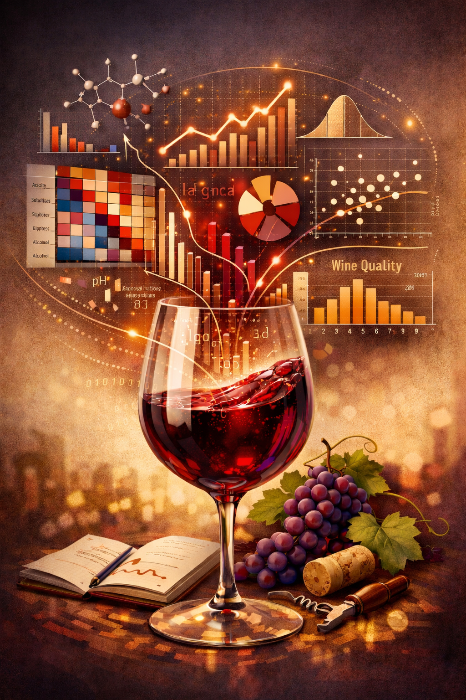

# AI Sommelier: Wine Quality Prediction 


## Problem Description

Wine quality assessment traditionally relies on human experts, whose evaluations can be subjective, time-consuming, and inconsistent. With the growth of wine production and distribution, there is a need for a reliable, scalable, and data-driven way to estimate wine quality before it reaches consumers or goes into further processing.

This project uses the [Wine Quality Dataset](https://www.kaggle.com/datasets/yasserh/wine-quality-dataset) to build a machine learning model that predicts the quality score of wine based on its physicochemical properties (such as acidity, sugar level, pH, sulfur dioxide, alcohol content, etc.). By analyzing these features, the model aims to estimate wine quality in a consistent and objective way.

The solution can be used by:

- wine producers — to monitor and improve production quality

- quality control teams — to automate quality screening

- researchers and students — to explore real-world regression/classification problems

- data scientists — to experiment with feature engineering and model performance optimization

Ultimately, this project demonstrates how machine learning can support decision-making in the food and beverage industry by transforming laboratory measurements into actionable quality predictions.


## Dataset Description

Source: https://www.kaggle.com/datasets/yasserh/wine-quality-dataset


### Columns Description

The dataset contains physicochemical properties of wine along with a quality score assigned by experts. Below is the description of each column:

| Column Name              | Type        | Description |
|--------------------------|------------|-------------|
| `fixed acidity`          | float      | Amount of non-volatile acids present in the wine (such as tartaric acid). Affects taste and stability. |
| `volatile acidity`       | float      | Amount of volatile acids (including acetic acid). High values may lead to a vinegar-like taste. |
| `citric acid`            | float      | Concentration of citric acid, which can add freshness and flavor to wine. |
| `residual sugar`         | float      | Remaining sugar after fermentation. Influences wine sweetness. |
| `chlorides`              | float      | Concentration of salts in wine, measured as chlorides. |
| `free sulfur dioxide`    | float      | Free SO₂ that helps prevent microbial growth and oxidation. |
| `total sulfur dioxide`   | float      | Total amount of SO₂ (free + bound forms). |
| `density`                | float      | Density of the wine, dependent on alcohol and sugar content. |
| `pH`                     | float      | Acidity level of the wine (0–14). Lower pH indicates higher acidity. |
| `sulphates`              | float      | Sulphates added to wine, impacting taste, preservation, and stability. |
| `alcohol`                | float      | Alcohol content of the wine (percentage by volume). |
| `quality`                | integer   | Target variable: wine quality score rated by experts (typically from 0 to 10). |


### Descriptive Statistics (`df.describe()`)

#### 1. **Key Statistics Overview**
| Metric | Count | Mean | Std | Min | 25% | 50% (Median) | 75% | Max |
|--------|-------|------|-----|-----|-----|--------------|-----|-----|
| **fixed acidity** | 1143 | 8.31 | 1.75 | 4.6 | 7.0 | 7.9 | 9.0 | 15.9 ⚠️ |
| **volatile acidity** | 1143 | 0.53 | 0.18 | 0.12 | 0.39 | 0.52 | 0.64 | 1.58 ⚠️ |
| **citric acid** | 1143 | 0.27 | 0.20 | 0.0 | 0.09 | 0.26 | 0.42 | 1.0 ⚠️ |
| **residual sugar** | 1143 | 2.53 | 1.36 | 0.9 | 1.9 | 2.2 | 2.6 | 15.5 ⚠️ |
| **chlorides** | 1143 | 0.09 | 0.05 | 0.01 | 0.07 | 0.08 | 0.09 | 0.61 ⚠️ |
| **free sulfur dioxide** | 1143 | 15.61 | 10.25 | 1.0 | 7.0 | 14.0 | 21.0 | 68.0 ⚠️ |
| **total sulfur dioxide** | 1143 | 45.91 | 32.78 | 6.0 | 21.0 | 37.0 | 61.0 | 289.0 ⚠️ |
| **density** | 1143 | 0.997 | 0.00 | 0.99 | 0.996 | 0.997 | 0.998 | 1.00 |
| **pH** | 1143 | 3.31 | 0.15 | 2.74 | 3.21 | 3.31 | 3.40 | 4.01 ⚠️ |
| **sulphates** | 1143 | 0.67 | 0.17 | 0.33 | 0.55 | 0.62 | 0.73 | 2.00 ⚠️ |
| **alcohol** | 1143 | 10.44 | 1.08 | 8.40 | 9.50 | 10.20 | 11.10 | 14.90 |
| **quality** (target) | 1143 | **5.66** | **0.81** | 3 | 5 | **6** | 6 | 8 |

#### 2. **Data Quality & Distribution Insights**
- **No missing values** (confirmed from `df.info()`): All 1143 samples complete.
- **Target distribution** (`quality`): 
  - Mean ≈ 5.66, Median = 6 → **slightly left-skewed** (most of fines 5-6).
  - Range: 3–8 (ordinal scale) → Suitable for **regression** (predict score) or **classification** (multi-class).
  - Low variance (std=0.81) → Balanced but narrow target range (good for models, less overfitting risk).
- **Feature distributions**:
  - **Normal-like**: `density` (std=0.001), `pH` (std=0.15), `alcohol` — tight ranges, minimal preprocessing needed.
  - **Right-skewed** (mean > median, fat tails): `residual sugar`, `chlorides`, `sulphates`, sulfur dioxides — common for chemical properties.
  - **Critical ranges** (domain knowledge for white wine):
    - `fixed acidity`: 7–9 g/L (healthy); max 15.9 — very high (potential spoilage).
    - `volatile acidity`: <0.6 g/L ideal; max 1.58 — too high (vinegar taste).
    - `alcohol`: 9–12% typical; good spread.

#### 3. **Outliers Detected (Potential Data Issues)**
- **High max values** (⚠️ above 75% + 3*IQR likely outliers):
  | Feature | Max | Issue |
  |---------|-----|-------|
  | total sulfur dioxide | 289 mg/L | **Extreme outlier** (normal: <100–150; preservative overdose?) |
  | free sulfur dioxide | 68 mg/L | High (normal: 15–30) |
  | residual sugar | 15.5 g/L | Sweet wine spike |
  | fixed acidity | 15.9 g/L | Acidic spoilage? |
- **Impact**: Outliers can bias tree models less (XGBoost/RF robust), but hurt Linear Regression. **Recommendation**: Investigate with boxplots; cap/remove top 1–5%.

#### 4. **Business Insights (Wine Quality Context)**
- **alcohol** (mean=10.44%, std=1.08): Strongest correlate with quality (higher % → better rating; sommelier knowledge).
- **Sulfur dioxides**: High variance → preservatives affect quality negatively if excessive.
- **Low std in density/pH**: Stable fermentation process; less predictive power.
- **Skewness suggests feature engineering**: Log-transform skewed features (e.g., `log(residual sugar +1)`).


## How to Run Locally and via Docker

### Run Locally

Clone repo:
```
git clone https://github.com/oleksiyo/vino-quality-predictor.git
```

1.  Go to work directory

```
cd vino-quality-predictor
```


2. Create virtual environment

```
python3.11 -m venv venv
source venv/bin/activate
```

3. Install dependencies

```
pip install -r requirements.txt
```